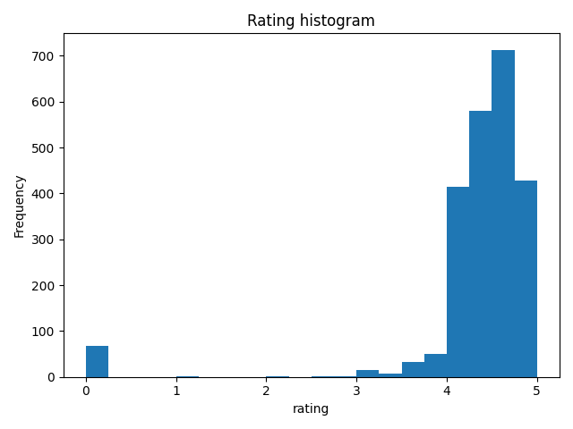
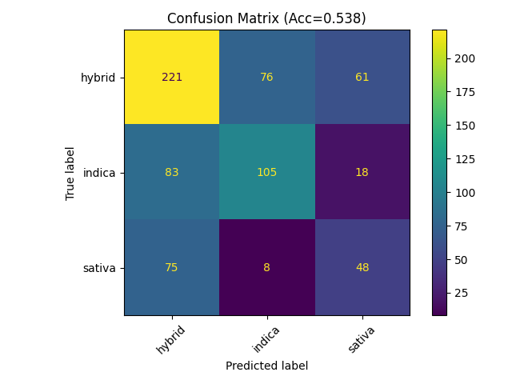

# Roteiro 1 — Decision Tree (cannabis.csv)

## Objetivo
O dataset cannabis.csv reúne informações de diferentes cepas (strains) de cannabis, contendo atributos descritivos e uma classe-alvo. As colunas utilizadas são:

 -- Strain (texto): nome da cepa.

 -- Type (categórica – alvo): classe da cepa (indica, sativa ou hybrid).

 -- Rating (numérica): avaliação média da cepa.

 -- Effects (texto): lista de efeitos relatados (ex.: Relaxed, Happy).

 -- Flavor (texto): sabores/aromas associados (ex.: Citrus, Earthy).

 -- Description (texto longo): descrição livre — não utilizada no modelo para reduzir ruído.
 

## Propósito do projeto
Construir um classificador de Árvore de Decisão para prever o Type (indica/sativa/hybrid) a partir dos demais atributos, avaliando o desempenho do modelo conforme a rubrica do exercício.

## Como o dataset foi usado
Exploração: análise da distribuição das classes (Type), estatísticas de Rating e visualizações (histograma/contagem).

## Pré-processamento:

 -- Padronização de Rating (vírgula → ponto; conversão para float).

 -- Tratamento de ausentes (textos vazios onde necessário).

 -- Construção de uma variável textual text_all concatenando Effects + Flavor + Strain.

 -- Vetorização de text_all com TF-IDF (uni + bigramas) e escala em Rating.

 -- Description foi descartada por ser texto longo e pouco estruturado, com baixa relação sinal/ruído.

 -- Divisão dos dados: train/test split estratificado (70/30) para manter o balanceamento das classes.

 -- Treinamento: DecisionTreeClassifier(criterion="gini", random_state=42) dentro de um Pipeline que aplica o pré-processamento e treina o modelo em sequência.

 -- Avaliação: métricas de acurácia, precisão/recall/F1 por classe, matriz de confusão e visualização dos níveis iniciais da árvore para interpretação das regras.

## Observações

 -- O critério Gini foi adotado por padrão (cálculo mais leve e, na prática, resultados similares à entropia).

## 1) Exploração dos Dados
Distribuição da classe:


Histograma do `rating`:



Estatísticas (`rating_describe.csv`) estão no repositório.

## 2) Pré-processamento
- `rating`: normalizado (vírgula → ponto) e escalado.
- Textos concatenados em `text_all = effects + flavor + strain` e vetorizados com **TF-IDF**.
- Remoção de linhas sem `Type`.

## 3) Split
`train_test_split(test_size=0.30, random_state=42, stratify=y)`.

## 4) Treinamento
`DecisionTreeClassifier(criterion="gini")` dentro de um `Pipeline` com `ColumnTransformer`.

## 5) Avaliação
Matriz de confusão:



Árvore (níveis iniciais):


Relatório de classificação está em `classification_report.txt` (no repositório).

## 6) Conclusões e Melhorias
- Ajustar hiperparâmetros com `GridSearchCV` (`max_depth`, `min_samples_split`, `min_samples_leaf`).
- Tratar stopwords/esparsidade específicas do domínio.
- Comparar com **RandomForest** como baseline robusto.

## Reprodutibilidade
```bash
pip install -r requirements.txt
python src/arvore.py
mkdocs serve -o
