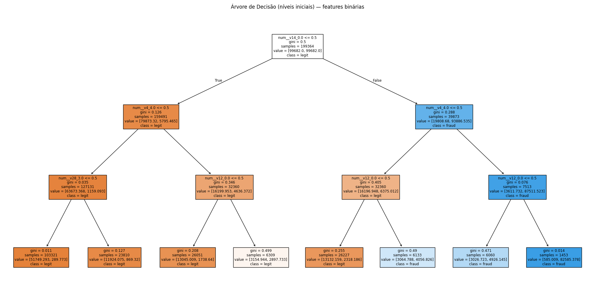

# Árvore de Decisão — Credit Card Fraud (creditcard.csv)

## Objetivo
Treinar um classificador de **Árvore de Decisão** para prever **fraudes em transações** (alvo `Class`: 0 = legítima, 1 = fraude) usando a base **creditcard.csv**. O foco é entregar um pipeline claro, com **features binárias (0/1)** e avaliação apropriada para **classe rara**.

---

## 1) Exploração dos Dados (EDA)
A base contém variáveis numéricas (`Time`, `V1..V28`, `Amount`) e o alvo binário `Class`.

- **Balanceamento do alvo**  
  

- **Histogramas**  
  

- **Estatísticas básicas:** `docs/Atividade1/img/basic_stats.csv`

**Insights rápidos**
- O conjunto é **fortemente desbalanceado** (fraudes ≪ legítimas).
- As variáveis `V1..V28` são transformações PCA do conjunto original (escala comparável).
- Métricas como **ROC AUC** e **PR AUC** são mais informativas que acurácia.

---

## 2) Pré-processamento
Para atender ao requisito de **entradas binárias (0/1)**:
- Imputação de **mediana** nos numéricos.
- **Discretização por quantis (10 bins)** + **one-hot** ⇒ cada faixa vira uma coluna 0/1.
- Todas as features numéricas (`Time`, `V1..V28`, `Amount`) foram transformadas dessa forma.

> Implementado com `KBinsDiscretizer(n_bins=10, encode="onehot-dense", strategy="quantile")` em um `ColumnTransformer` dentro do `Pipeline`.

---

## 3) Divisão dos Dados
`train_test_split(test_size=0.30, random_state=42, stratify=y)`

---

## 4) Treinamento do Modelo
`DecisionTreeClassifier(criterion="gini", class_weight="balanced", max_depth=8, min_samples_leaf=5)`

- `class_weight="balanced"` compensa o desbalanceamento.
- Hiperparâmetros leves para reduzir overfitting e manter interpretabilidade.

---

## 5) Avaliação do Modelo
**Matriz de confusão**


**Resumo de métricas (gerado automaticamente)**
<!-- se tiver pymdownx.snippets ativado, descomente a linha abaixo -->
<!-- --8<-- "docs/Atividade1/metrics_summary.md" -->

> Relatório completo: `classification_report.txt`

---

## 6) Interpretação e Resultados
**Árvore (níveis iniciais)**



**Discussão**
- O modelo aprende **regras simples** sobre faixas de `V*` e `Amount`.  
- Em **fraude**, priorizamos **Recall** (reduzir falsos negativos).  
- **PR AUC** é o número-chave em cenários de classe rara.

**Melhorias possíveis**
- `GridSearchCV` para `max_depth`, `min_samples_leaf`, `min_samples_split`.
- Ajuste de **threshold** para otimizar `Recall` de fraude.
- Comparar com **RandomForest** / **Gradient Boosting**.
- *Undersampling/Oversampling* como alternativa a `class_weight`.

---

## Reprodutibilidade
```bash
pip install -r requirements.txt
python src/arvore.py        # ou rode o notebook
mkdocs serve -o
